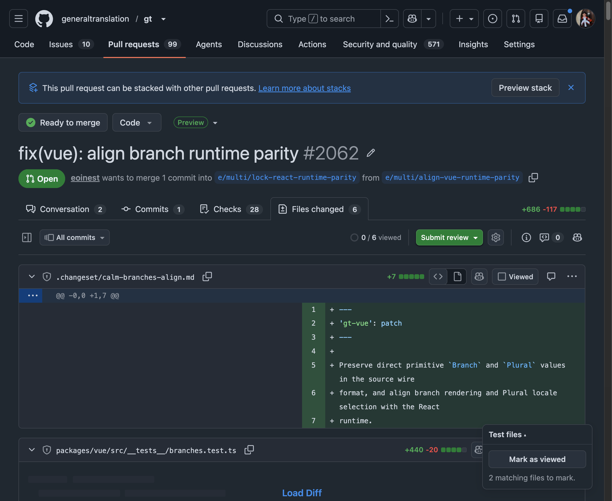

# GitHub Test File Reviewer

This Chrome extension adds a small button to GitHub pull requests. Click it to mark test files as viewed, collapse their diffs, and collapse `__test__` or `__tests__` directories in the file-tree sidebar.

Matching is case-insensitive. A file matches when its path contains the literal `__test__` or its filename follows `*.test.*`, such as `src/__test__/button.ts`, `src/button.__test__.ts`, or `src/button.test.tsx`.

## Screenshot



Shown on [`generaltranslation/gt` pull request #2062](https://github.com/generaltranslation/gt/pull/2062/changes).

## Install

1. Install dependencies and build the extension:

   ```sh
   npm install
   npm run build
   ```

2. Open `chrome://extensions` in Chrome.
3. Enable **Developer mode**.
4. Choose **Load unpacked** and select this repository's `dist` directory.

## Use

Open a GitHub pull request's **Files changed** page. Open the **Test files** dropdown at the lower right and click **Mark as viewed**. Already-viewed files are left alone, and expanded `__test__` and `__tests__` directories in the sidebar are collapsed at the same time. The action remains available when matching files are already viewed but a test directory is still expanded.

Both GitHub's `/pull/.../files` route and its `/pull/.../changes` route are supported. The extension requests access only to GitHub pull-request pages and does not send data anywhere.

## Develop and verify

```sh
npm run check
```

For a local browser fixture, build first and then run:

```sh
node scripts/fixture-server.mjs
```

Visit `http://127.0.0.1:4173/eoinest/example/pull/1/files`. The fixture loads the built content script directly so the review interaction can be exercised without changing a real pull request.
